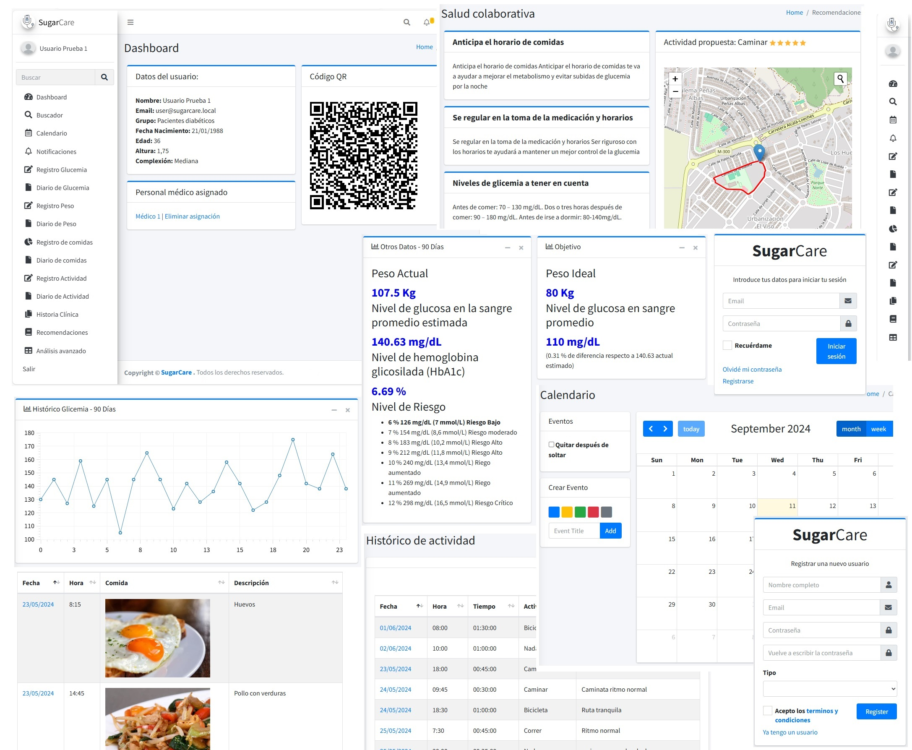

## TFG - Plataforma de telemedicina para la diabetes
Sugarcare - Trabajo de Fin de Grado (TFG). Plataforma de seguimiento para enfermedades crónicas, con especial énfasis en la diabetes, surge de una conjunción de interés personal, relevancia social y el potencial impacto tecnológico en el ámbito de la salud. La diabetes, siendo una de las enfermedades crónicas más prevalentes a nivel mundial, afecta a millones de personas, impactando significativamente su calidad de vida y generando una carga considerable sobre los sistemas de salud. Este proyecto se alinea con mi aspiración de contribuir al avance de la tecnología aplicada al bienestar de las personas que padecen la enfermedad. La posibilidad de integrar conocimientos de programación, diseño de sistemas y análisis de datos para crear una herramienta que pueda mejorar la calidad de vida de las personas es una fuente de motivación considerable

## Uso

Para utilizar la aplicación se debe desplegar entorno LAMP O WAMP, también se puede desplegar más cómodamente con docker.

## Parametros de configuración de la aplicación
# sugarcare
url_base = "http://URL_HOST/"
secure_url = "https://URL_HOST/"

# Configuración
# 1.Crear dentro del directorio config el fichero configuration.php
interface configuration {

    /** Parametros de la base de datos **/
    const host = '';
    const user = '';
    const password = '';
    const database = '';
}

